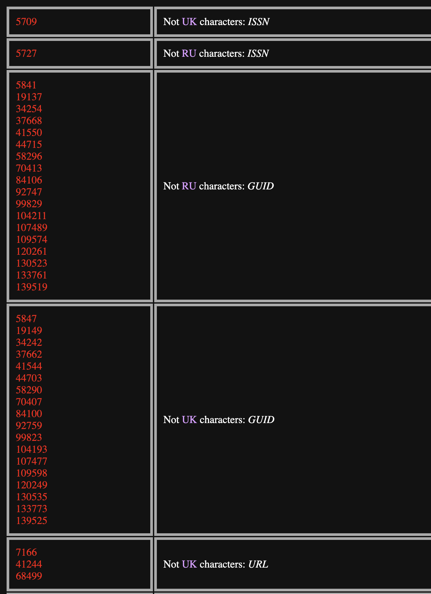
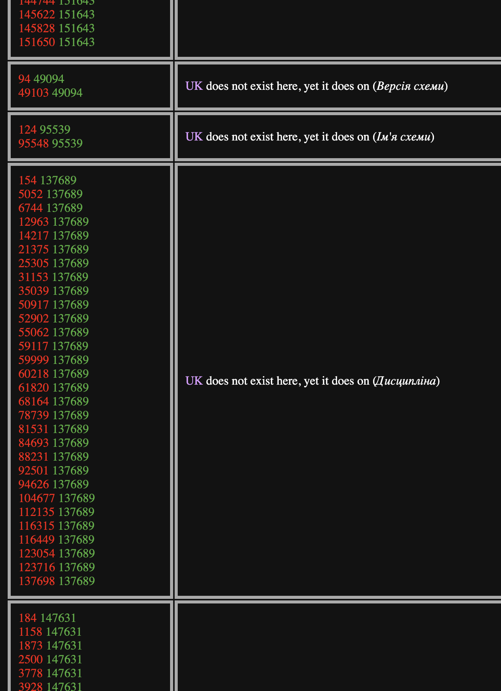

# specify_tools
This repository has a collection of tools for testing and translating Specify 6, 7 and Web Portal

## Makefile
This is a tool that helps quickly build and run any version of Specify

```sh
make run   VERSION=6_8_00/6_8_00_L10N/6_7_01/6_7_04 RUN=S/S1/W/D/B
make pull  BRANCH=develop # will update local specify build from GitHub # can select any branch
make build BRNACH=develop UPDATE=y INSTALL=y # runs make pull and then builds it

# RUN values:
#  S  - Specify4GB
#  S1 - Specify
#  W  - SpWizard
#  D  - DataExporter
#  B  - SpBackupRestore
```

## release_log
This app will provide a list of issues from a repository and will give you an ability to filter the results.
The only configuration you need to on the server-side is providing the GitHub username and GitHub token at the beginning of the `release_log/index.php` file. You can generate a GitHub token [here](https://github.com/settings/tokens). That token does not need to have any permissions.

## file_gen.php
This script generates `.csv` files full of data according to different parameters

The script accepts the following GET parameters:
   - count //how many lines to generate (excluding the header)
   - to_file - // if set to 1, the script will prompt the browser to download the resulting file. if set to 0, the result will be shown as plain text

Also, there are following options inside the file:
```php
$FILE_NAME = $count.'_localities.csv'; //file naming format. default will look like 7000_localities.csv, if the $count is 7000
$cols = 5; //how many columns there are
$array = []; //predefined rules go here (see below)
$all_rows_same = !true; //will make each line consist of the $default_value. Otherwise will line number and predefined rules
$default_value = 1;
```

There also is a support for predefined rules:
```php
//[func_name,[param1,param2,...] // you can create and call your own functions
//'static_val' // static value for all cells of that column
//'' - use def if defined. else use $i

//example usage
$array[1] = ['custom_rand', [-90000, 90000, 1000]]; // this will make each cell in 2nd column call the custom_rand(-90000, 90000, 1000) function
$array[2] = 'Point';
$array[3] = '';
```

Currently, there is no support for specifying column headings, but they can be edited easily in a resulting file


## xml_localization
The scripts in this folder are used for localizing the `schema_localization.xml` files

### config.php
```php
$xml_file_name = 'schema_localization'; //source file name. currently will search for xml_file_name.'.xml' file
$file_path = __DIR__.'/main_schema/'; // the absolute path where main xml file is located. All resulting files would be generated in that folder
$new_line = "\n"; // <br> // specifhy which new line character to use
$optimize_files = true; // fill remove redundant and similar strings in the translation files
$optimized_files_prefix = $optimize_files ? '_optimized' : ''; // prefix for optimized files
$overwrite_non_capitalized = false; // overwrite original files with version where lines are capitalized
$capitalized_files_prefix = $overwrite_non_capitalized ? '' : '_capitalized'; // capitalized files prefix
$languages = [ // settings for languages to generate. this should not include en language. other languages, that are not specified in this list, but are present in the xml file are not going to be deleted or modified
    'uk' => [ // ukrainain
        'xml_attributes' => [ // specify xml attributes for each node of this language
            'language' => 'uk',
            'country' => 'UA',
            'variant' => '',
        ],
        'capitalize_all' => 'true', // wheather to do ucfirst() for every line in the translated files
    ],
    'ru' => [
        'xml_attributes' => [
            'language' => 'ru',
            'country' => 'RU',
            'variant' => '',
        ],
        'capitalize_all' => 'true',
    ],
];
```

### deconstruct_strings.php
Just run this script

No user input required, considering that `config.php` is properly set up

This will show the `Done!` message when it is done. May show warnings and errors if there are problems with the original `.xml` file

This will generate several files:
  - en_v0.txt  - file containing all lines of English. This file must not be modified
  - en_v1.txt  - will be generated only if $optimize_files is true. It Will be the same as `en_v0.txt`, but strings will have numbers removed from them ([0-9]). This file must not be modified
  - en_v2.txt  - will be generated only if $optimize_files is true. Same as `en_v1.txt`, but all the strings are unique. This file must not be modified
  - en.txt     - same as en_v0.txt if $optimize_files is false, or en_v2.txt, if $optimize_files is true. This is the file that should be modified by the user if there is a need to change the typos in the English localization
  - <lang>.txt - will be generated for each language (e.x. `uk.txt`). This file will be empty and should be modified by the user. The number and the order of lines in these files and `en.txt` should be the same
 
### reconstuct_strings.php
After localization is done and translated strings are saved in <lang>.txt, this script should be run to merge all files into new `schema_localization.xml`

No user input required, considering that `config.php` is properly set up

This will show errors and warnings if there are any problems with any files or the config

This file will generate <lang>`$capitalized_files_prefix`.txt files for each language in $languages that has `capitaze_all` of true and if $overwrite_non_capitalized is false

This file will generate <lang>`$optimized_files_prefix`.txt files for all languages in $languages and 'en' if $optimize_files is true

After the script is done, the resulting `.xml` the file will be output. Currently, the script will create the
 `schema_localization_final.txt` but will not able to save the new schema file because of the problems with encodings for Cyrillic. So the user should save the output into that file manually

The script can work if there are other languages available in the file, regardless of the fact they are going to be updated or not

### show_localization_errors.php
This is an ultimate script that will find all kinds of errors in the localization strings in the selected XML file. The result will be outputed in a neat table

Here are some sample outputs:



This is the list of programs available:
```php
/*
 * PROGRAMS
 *
 * a - show strings that do not have any characters from their language
 * b - show strings that exist only for english language
 * c - show strings that are in a different case from the one used in the English string
 * d - detect the same language used more than once for the same language
 * e - detect non localized strings that were localized elsewhere
 * f - strings start with different numbers/special characters
 * g - strings end   with different numbers/special characters
 *
 * */
```

Specify PHP file location:
```php
$source = file_get_contents(__DIR__ . '/main_schema/schema_localization.xml'); // link to xml file
```

Config languages (all except for english)
```php
const LANGUAGES = [
    'uk' => ['country'  => 'UA', /* language value and country values (same way as it is in the XML file) */
                'charset'  => 'а-яіїґ', /* a subset of characters used in this language (lowercase only) */
                'programs' => ['a' => TRUE, /* whether to run any of these programs on this language*/
                               'b' => TRUE,
                               'c' => TRUE,
                               'd' => TRUE,
                               'e' => TRUE,
                               'f' => TRUE,
                               'g' => TRUE,
                ],
    ],
```

Specify output mode for each program
```php

$programs = [

    /*
     *
     *  output_mode:
     *  0 - raw output
     *  1 - show distinct (strips line numbers)
     *  2 - groups results (concat line numbers
     *
     * */

    'a' => ['output_mode' => 2],
    'b' => ['output_mode' => 2],
    'c' => ['output_mode' => 2],
    'd' => ['output_mode' => 2],
    'e' => ['output_mode' => 2],
    'f' => ['output_mode' => 2],
    'g' => ['output_mode' => 2],
];

```

You can also change the output styles by navigating to the `FORMATTING` section of the program

Also `const SHOW_E_OUTPUT_AS_JSON = TRUE;` is responsible for displaying the output of `e` program as JSON at the end of the page (only if there is something to display). This output is supposed to be used in `auto_localize.php` 

### auto_localize.php

This file will automatically add localization for strings based on the values they have elsewhere in the same file. It takes the JSON output from the `e` program of `show_localization_errors.php` and works based on that

```php

//Run show_localization_errors.php with E program turned on and JSON output turned on
//That will generate a textarea with json inside
//Copy that into here
$output_from_show_localization_errors_e = '{}';

```

Specify PHP file location:
```php
$data = file_get_contents(__DIR__ . '/main_schema/schema_localization.xml'); // link to the source xml file
```

## txt_localization
The scripts in this folder should be used to localize `.properties` and `.utf8` files

### get_en.txt
This script will strip the key names from the file and output or save the new file with the specified name

### to_upper.txt
This script will capitalize all the strings in the specified file and output or save the changes into the file with the specified name

### glue.php
This file should be used to connect key names and localization values from the new language. It will output or save the result into a file with the specified name

### looper.php
This file is similar to `glue.php`, but automatically scans for all the files in the selected directory and creates new trimmed language files based on each of those
