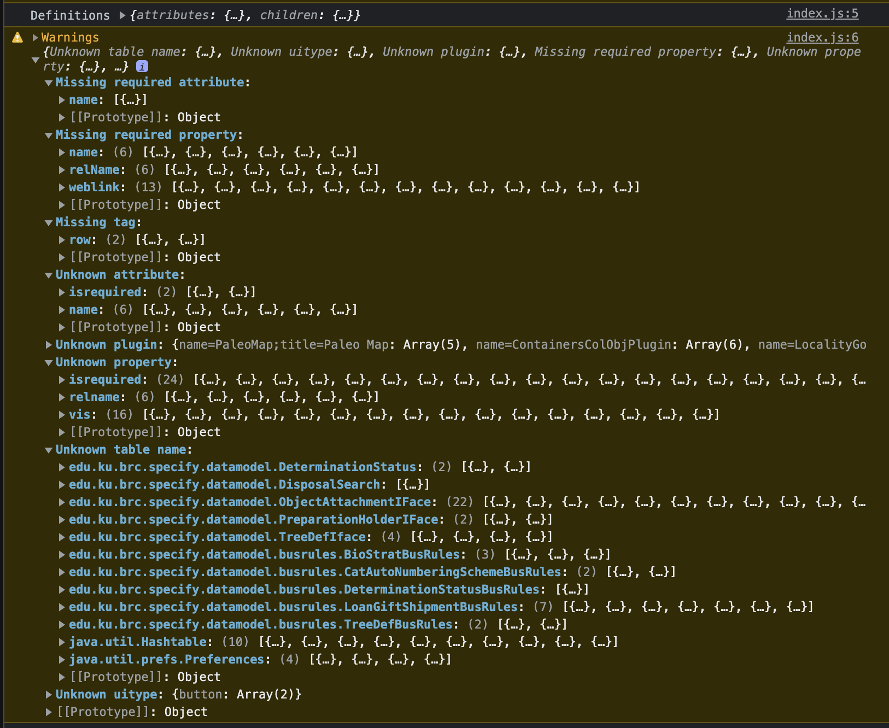
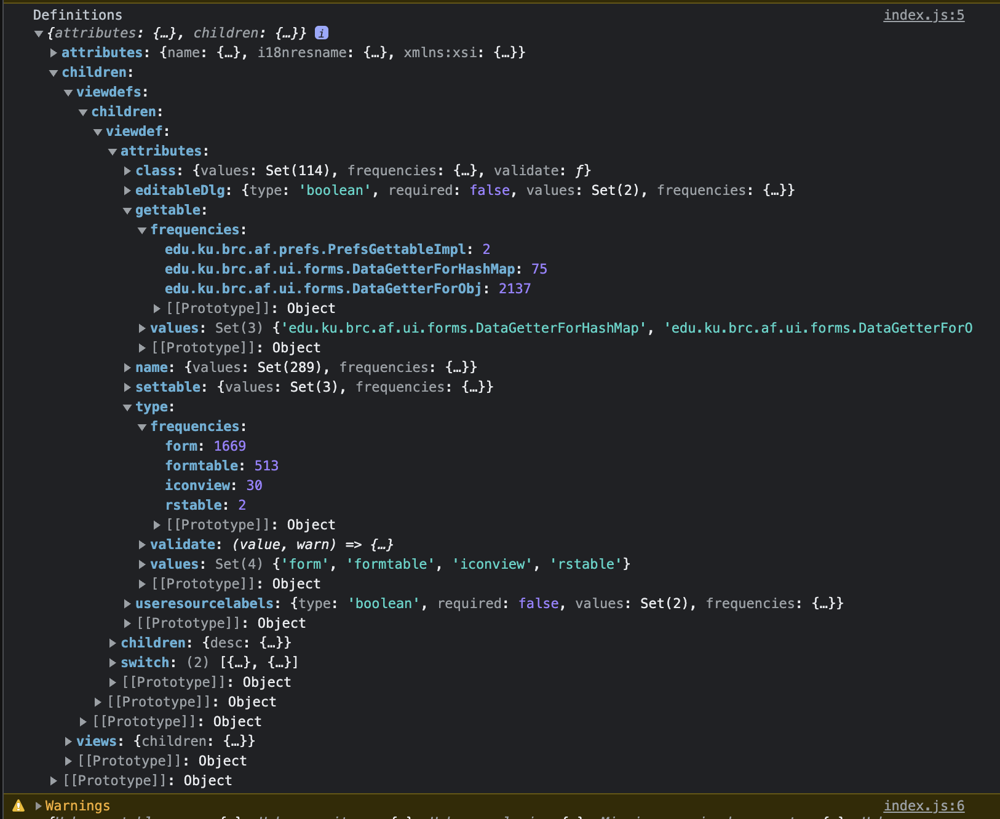

# XML Inspector

- Walk through a series of XML files
- Compare their structure to a defined schema
- Log any differences
- Run validation
- Generate a report
- Also, produce a list of distinct values for each XML attribute

Validation results:



Distinct values for each attribute and it's frequencies are noted down:



## Features

- XML schema definition supports `switch` statements to use different
  schema based on arbitrary criteria. Nested switches are supported too

## Installation

1. Clone this repository and open current directory (`./xml-inspector`)
2. Either [create new schema] or pick an existing one from the one's in the
   [./schema](./schema) directory and follow the instructions in it's README.md
3. Start any kind of web-server from current directory:

   Example:

   Start simple python server on port 80 and serve files from current
   directory

   ```bash
   sudo python3 -m http.server 80
   ```

4. Open web browser at a URL used by the web-server.

   In the above example it is [http://localhost:80/](http://localhost:80/)
5. In the input field on the page, enter the name of the schema you wish to use.
   This name is coming from the name of some directory in
   the [./schema](./schema) directory.
6. Open browser console to see output from the tool

   The output will be two objects:

    - First one is the XML schema, but with a `values` set added to
      each attribute definition - it contains distinct list of values
      used for that attribute across all the files
    - Second one is all the warnings that occurred when validating XML
      against the schema

## Remarks

Tool is running in the browser rather than in Node.js because it relies on DOM
APIs for XML parsing.

Tool was used to scan all Specify 6 form definitions to discover a list of all
the attributes that Specify 6 uses, and how they should be handled by the
Specify 7 form editor.

## Schema

For example, form XML schema is defined
in [./schema/form-definitions/definitions.js](./schema/form-definitions/definitions.js).

Format for schema definition (using TypeScript syntax):

```typescript
type Definitions = Node;

type Node = {
  readonly required?: boolean;
  readonly attributes?: Record<string, Attribute>;
  readonly children?: Record<string, Node>;
  readonly validate?: ValidateFunction<Element>;
} & Switch;

type Attribute = {
  // 'string' is default
  readonly type?: 'string' | 'number' | 'boolean';
  readonly required?: boolean;
  // Only called if value is not null
  readonly validate?: ValidateFunction<string>;
  // Will be added by execute.js after parsing
  // Will contain a list of distinct values for this attribute
  // readonly values: ReadonlySet<string | null | undefined>;
  // readonly frequencies: Record<string, number>;
};

type ValidateFunction<TYPE> = (
  value: TYPE,
  warn: (
    message: string,
    pathParts?: ReadonlyArray<string | readonly [string, object]>,
  ) => void,
  // XML Element
  node: Element
) => void;

// Conditionally apply a schema
type Switch = {
  readonly switch: ReadonlyArray<Node & Case>;
  readonly switchMapper?: (
    // XML Element
    node: Element
  ) => unknown;
};

type Case = {
  // Either a function that receives a value and returns a boolean
  // or the value to be compared agains
  // The function will be called with the XML node, unless
  // switchMapper was present, in which case return of swithcMapper
  // will be used
  readonly condition: ((value: unknown) => boolean) | unknown;
};
```